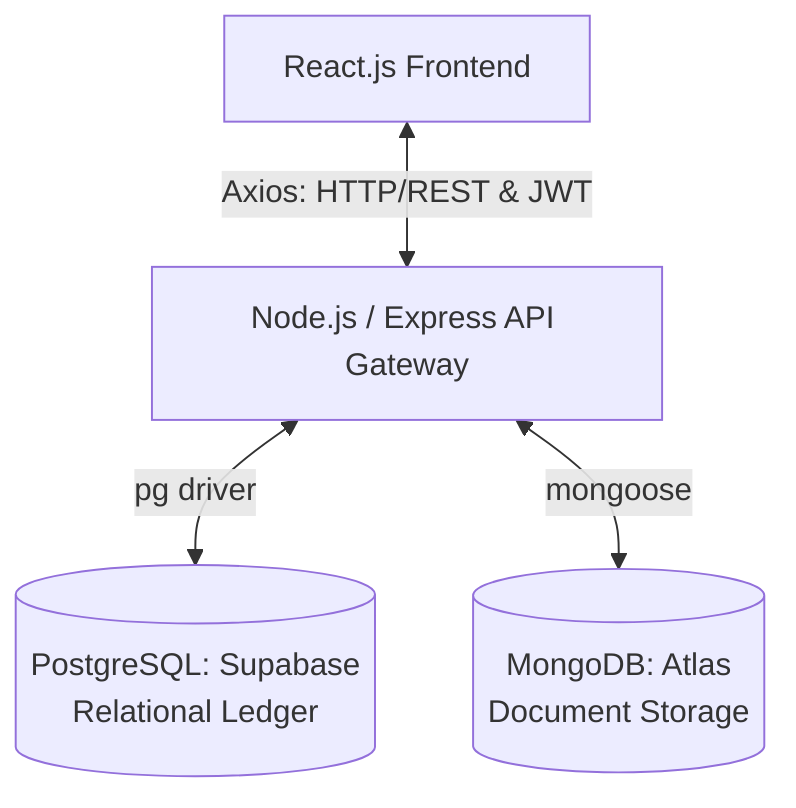

# 🎓 Campus Freelance & Skill-Share Hub

**▶️ [Watch the Full Demonstration Video Here](#) *(Replace the '#' with your Google Drive Link)***

---

## 🎯 1. Problem Statement
**The Challenge:** University students frequently possess valuable skills (tutoring, graphic design, coding assistance) but lack a centralized, secure, and campus-specific platform to market these skills. Current solutions rely on fragmented WhatsApp groups or physical notice boards, leading to unverified profiles, lost booking requests, and poor skill-matching.

**The Solution:** The Campus Hub is a polyglot microservice application that acts as a secure marketplace. It allows students to authenticate securely, dynamically list their skills (Gigs), and officially book services from peers. It prevents self-booking, manages dual-database transactions, and provides real-time UI feedback.

---

## 🏗️ 2. System Architecture & Tech Stack

This project utilizes a **Polyglot Persistence** strategy, separating strict relational data from flexible document data to optimize performance and scalability.

* **Frontend:** React.js, Vite, Tailwind CSS, React Router DOM, React-Hot-Toast.
* **Backend:** Node.js, Express.js, Bcrypt.js, JSON Web Tokens (JWT).
* **Databases:** PostgreSQL (Supabase) & MongoDB (Atlas).

💾 3. Polyglot Database Schemas
Relational Schema (PostgreSQL)
Handles strict transactional relationships, financial ledgers, and user authentication. Ensures ACID compliance.

Code snippet
erDiagram
    USERS {
        uuid id PK
        string name
        string email UK
        string password_hash
        string role
        timestamp created_at
    }
    BOOKINGS {
        uuid id PK
        string gig_id "Ref: MongoDB ObjectId"
        uuid client_id FK
        uuid freelancer_id FK
        string status
        timestamp scheduled_date
        text notes
    }
    USERS ||--o{ BOOKINGS : "makes (client)"
    USERS ||--o{ BOOKINGS : "receives (freelancer)"
Document Schema (MongoDB)
Handles flexible, schema-less records for skill listings. Allows users to add dynamic tags and descriptions without altering a rigid table structure.

JSON
// Gigs Collection
{
  "_id": "ObjectId('69e32898fc...')",
  "freelancer_id": "UUID from PostgreSQL", 
  "title": "String",
  "description": "String",
  "category": "String",
  "hourly_rate": "Number",
  "is_active": "Boolean"
}
🖥️ 4. Frontend Component Hierarchy
The React frontend is structured to maintain a strict separation of concerns between routing, state management, and UI presentation.

Plaintext
App (Router Provider & Global Auth State)
 │
 ├── Navigation Bar (Smart rendering based on useLocation & Auth status)
 │    ├── Toaster (react-hot-toast notification overlay)
 │
 ├── Pages (Routes)
 │    ├── /login -> Login.jsx (Auth Form & JWT persistence)
 │    ├── /register -> Register.jsx (User creation form)
 │    └── /dashboard -> Dashboard.jsx (Protected Route)
 │
 └── Dashboard.jsx Internal Logic
      ├── Gig Creation Form (POST to /api/gigs)
      ├── User's Postings Grid (Filtered array based on JWT ID)
      │    └── Gig Card (Delete Action)
      └── Available Campus Gigs Grid (Filtered array)
           └── Gig Card (Book Action)
🔌 5. API Documentation
Auth Service (SQL)
POST /api/auth/register: Expects {name, email, password, role}. Returns 201 + User UUID.

POST /api/auth/login: Expects {email, password}. Returns 200 + JWT Token.

Gig Service (NoSQL)
GET /api/gigs: Returns 200 + Array of active gig objects.

POST /api/gigs: Expects {freelancer_id, title, description, category, hourly_rate}. Returns 201.

DELETE /api/gigs/:id: Deletes document by MongoDB _id (Requires Ownership). Returns 200.

Booking Service (Cross-Database Transaction)
POST /api/bookings: Expects {gig_id, client_id, freelancer_id, scheduled_date, notes}. Returns 201.

🧠 6. Architectural & Development Assumptions
Cloud-First Infrastructure: The application assumes constant internet access to communicate with cloud-hosted databases (Supabase and Atlas) to bypass local firewall restrictions.

Stateless Authentication: The server does not track sessions in memory; all authentication state is managed via JWTs stored in the client's localStorage.

Cross-Database Integrity: Because PostgreSQL and MongoDB are not inherently linked via hard constraints, the application logic assumes the freelancer_id stored in MongoDB will always exactly match a valid UUID in the PostgreSQL users table.

Local Network DNS: To bypass local ISP IPv6 resolution errors (ENOTFOUND), the PostgreSQL connection utilizes IPv4 transaction pooler endpoints.

🚀 7. Local Development Setup
1. Backend Setup
Bash
cd backend
npm install
Create a .env file in the backend/ folder:

Code snippet
PORT=5000
PG_URI=your_postgresql_connection_string
MONGO_URI=your_mongodb_connection_string
JWT_SECRET=your_secret_key
Start the server:

Bash
node server.js
2. Frontend Setup
Bash
cd frontend
npm install
npm run dev
